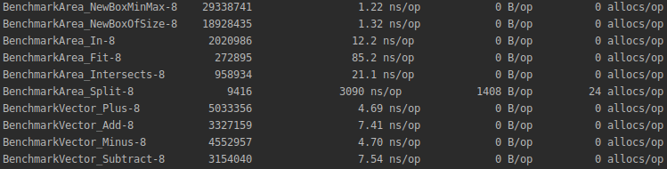

# protometry

[](https://app.codacy.com/gh/louis030195/protometry?utm_source=github.com&utm_medium=referral&utm_content=louis030195/protometry&utm_campaign=Badge_Grade_Dashboard)
[](https://pkg.go.dev/github.com/louis030195/protometry)

Geometry on protobuf stubs, could be also implemented in other languages.

## Why developing another Math library instead of using existing ones ?

This library uses protobuf types, allow doing math directly on networked data.

## Installation

```bash
go get github.com/louis030195/protometry
```

## Usage

```go
package main

import (
    "github.com/louis030195/protometry/api/vector3"
    "github.com/louis030195/protometry/api/volume"
    "log"
)

func main() {
    vector := vector3.NewVector3One()     // 1,1,1
    log.Printf("My vector: %f", vector.X) // 1
    vector.X = 12.6422

    v := vector3.NewVector3(0, 0, 0)
    v.Scale(3.5) // 0,0,0
    v2 := v.Plus(*v) // 0,0,0
    log.Printf("My vector: %v", v2) // 0,0,0

    a := volume.NewBoxMinMax(0, 0, 0, 1, 1, 1)
    b := volume.NewBoxOfSize(2, 2, 2, 0.5)
    a.Fit(*b) // False
}
```

## Features

### Vectors

- [x] Build vectors of N dimensions
- [x] Vector comparison (min, max, equal)
- [x] Normalization
- [x] Absolute value
- [x] Plus, Minus, Scale, Dot(vector product), Div(scalar division), Cross product, Euclidean Norm, Angle, Lerp

### Volumes

- [x] Box Intersections, Fit, split

## Test

```bash
make test
```

## Benchmarks

```bash
make bench
```



## TODO

- [ ] Z encoding
- [ ] Handle other volumes (sphere, capsule, mesh ...)
- [ ] Improve benchmarks
